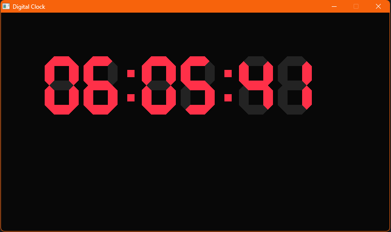
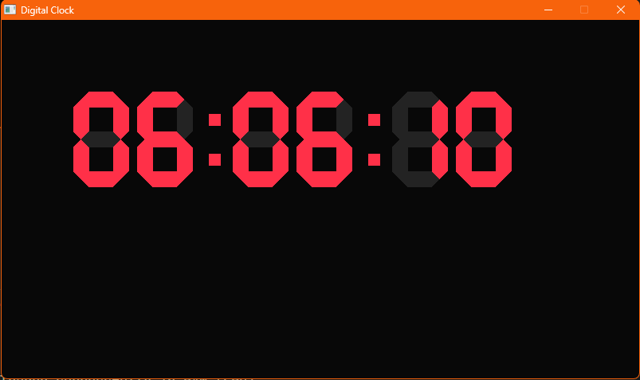

# Digital Clock

A simple seven-segment digital clock built with C++ and raylib.

The program reads your local system time every frame, converts the hour to 12-hour format, and draws `HH:MM:SS` using custom segment-drawing functions.

## Preview





## Features

- Real-time clock display using local system time
- 12-hour hour conversion
- Custom seven-segment digit rendering
- Separate colon drawing for the time separators
- Lightweight raylib project with a simple `Makefile`

## Requirements

- C++20 compiler
- raylib
- MSYS2 UCRT64 toolchain on Windows

This project currently builds with the paths defined in [Makefile](Makefile).

## Build And Run

```bash
make
make run
make clean
```

## Project Files

```text
digital_clock/
├── digital_clock.cpp    main source file and drawing logic
├── Makefile             build and run commands
└── Pictures/
    ├── clock1.png       first project screenshot
    └── clock2.png       second project screenshot
```
